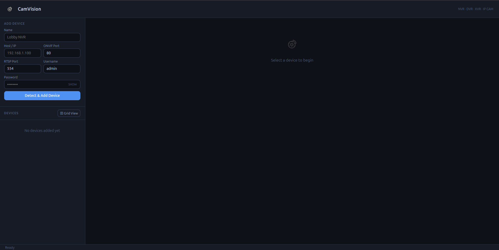
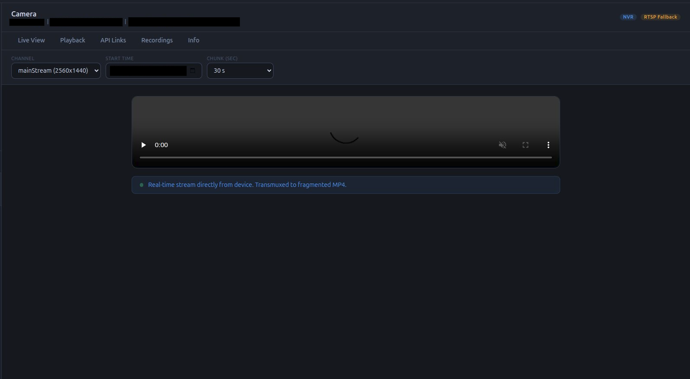

# CamVision

CamVision is a high-performance, developer-friendly video gateway that bridges professional IP cameras/NVRs to modern web browsers. It eliminates the need for proprietary plugins or complex HLS setups by using real-time Fragmented MP4 (fMP4) transmuxing.

<p align="center">
  
</p>

## Architecture

```text
                                  +-------------------+
                                  |     Browser       |
                                  | (HTML5/JS Video)  |
                                  +---------^---------+
                                            |
                                            | HTTP (fMP4 Stream)
                                            |
                                  +---------v---------+
                                  |     CamVision     |
                                  | (FastAPI + ffmpeg)|
                                  +---------^---------+
                                            |
                                            | RTSP (Video/Audio)
                                            |
           +--------------------------------+--------------------------------+
           |                                |                                |
  +--------v--------+              +--------v--------+              +--------v--------+
  |  IP Camera A    |              |  IP Camera B    |              |      NVR        |
  |  (Profile S/G)  |              |  (RTSP Only)    |              |  (Multi-chan)   |
  +-----------------+              +-----------------+              +-----------------+
```

## Key Features

- **Real-Time Live Feed**: Instant streaming from any RTSP/ONVIF source directly in `<video>` tags.
- **Grid View Monitor**: A responsive Grid View to monitor all your CCTV channels simultaneously.
- **Time-Indexed Playback**: Fetch and view specific video segments (chunks) from camera storage without downloading full files.
- **Universal Compatibility**: 
    - **Tier A**: Full ONVIF Profile G support.
    - **Tier B**: Intelligent RTSP fallback for Hikvision, Dahua, Uniview, and more.
- **Zero-Footprint**: No video is ever stored on the server—data is piped directly from camera to browser in RAM.
- **Docker Ready**: One-click deployment with pre-configured FFmpeg.

## Preview

<p align="center">
  
  
</p>

---

## Quick Start

### Prerequisites
- **Python 3.10+**
- **FFmpeg** (Required for video transmuxing)

### 1. Installation
```bash
# Clone the repository
git clone https://github.com/arpitpatel1364/CamVision.git
cd CamVision

# Create and activate virtual environment
python -m venv venv
source venv/bin/activate  # On Windows: venv\Scripts\activate

# Install dependencies
pip install -r requirements.txt
```

### 2. Run the Hub
```bash
python main.py
```
Open your browser at http://localhost:8000.

---

## Docker Deployment
The easiest way to run CamVision with all dependencies (including FFmpeg) correctly configured:

```bash
docker-compose up -d
```

---

## Configuration
CamVision uses a cameras.json file to manage your device registry. 
1. Copy cameras.example.json to cameras.json.
2. Add your device details (IP, ONVIF port, and Credentials).
3. The system will automatically probe and detect your device's capabilities (NVR vs IP-CAM and Tier support).

---

## Documentation
For detailed technical info, architecture diagrams, and contribution guides, see technical_documentation.md.

## License
Internal/Open Source - See LICENSE for details.
